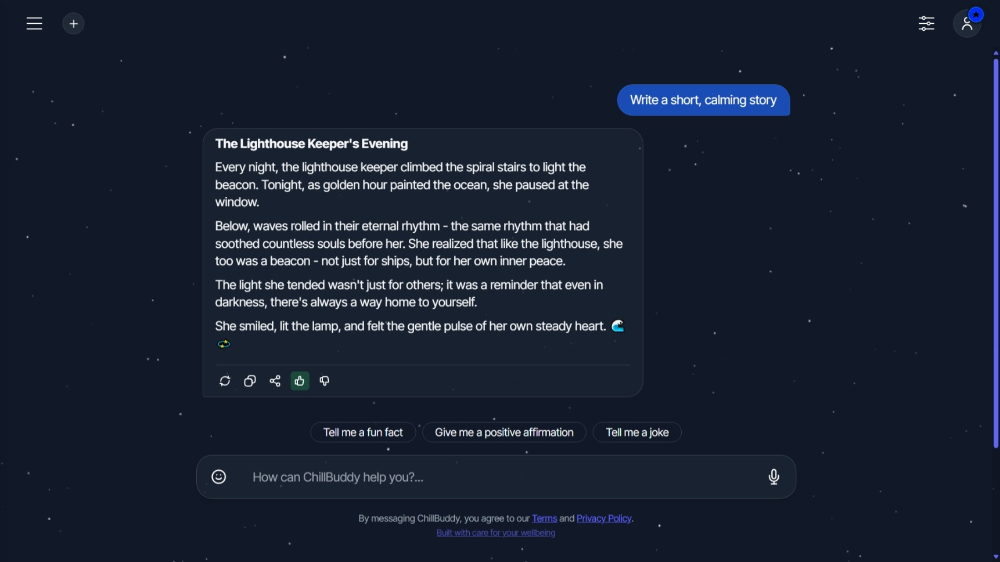
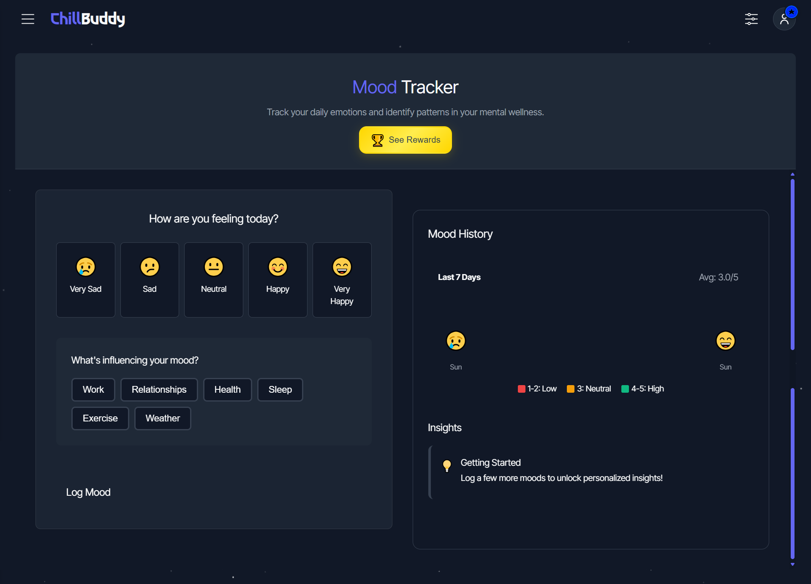
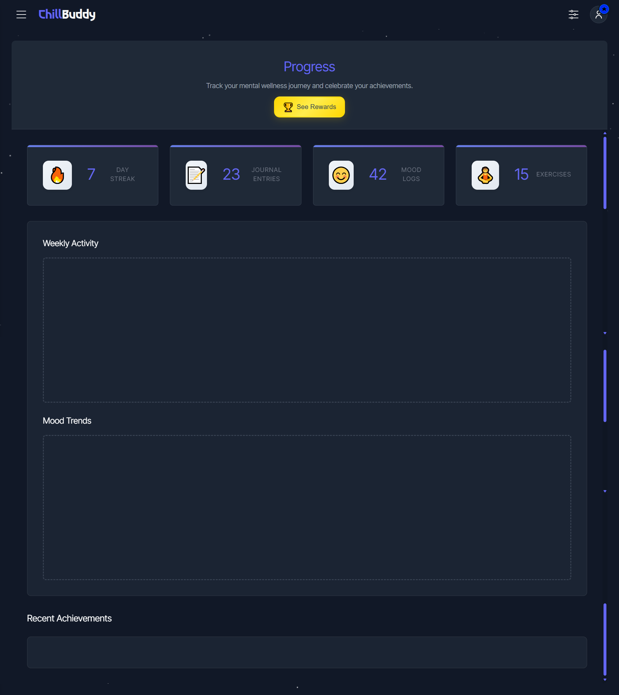
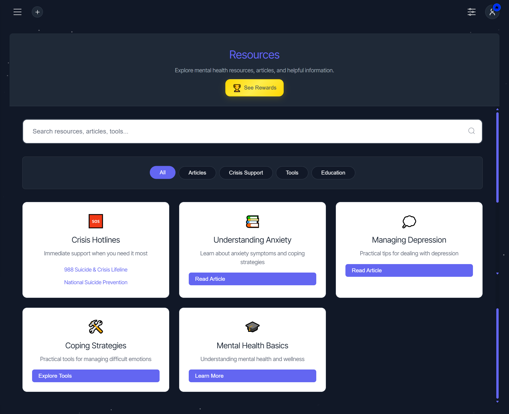
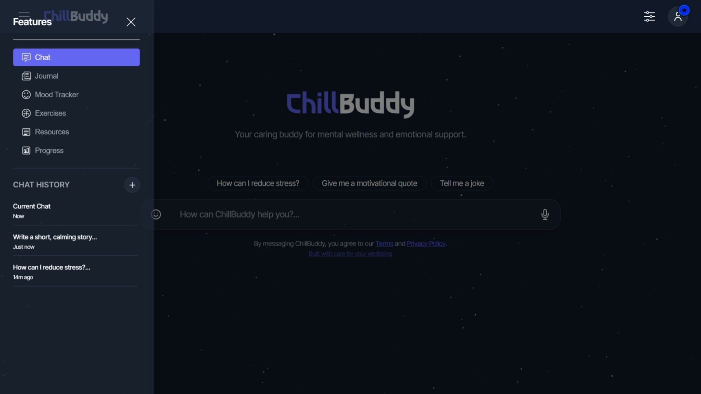
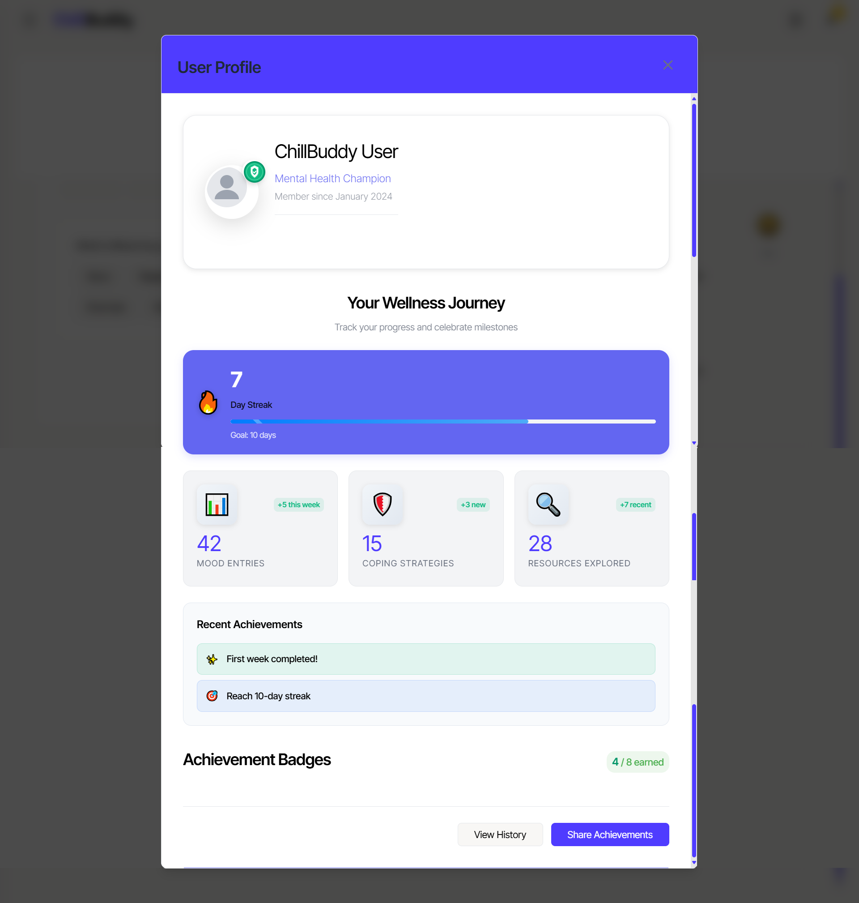
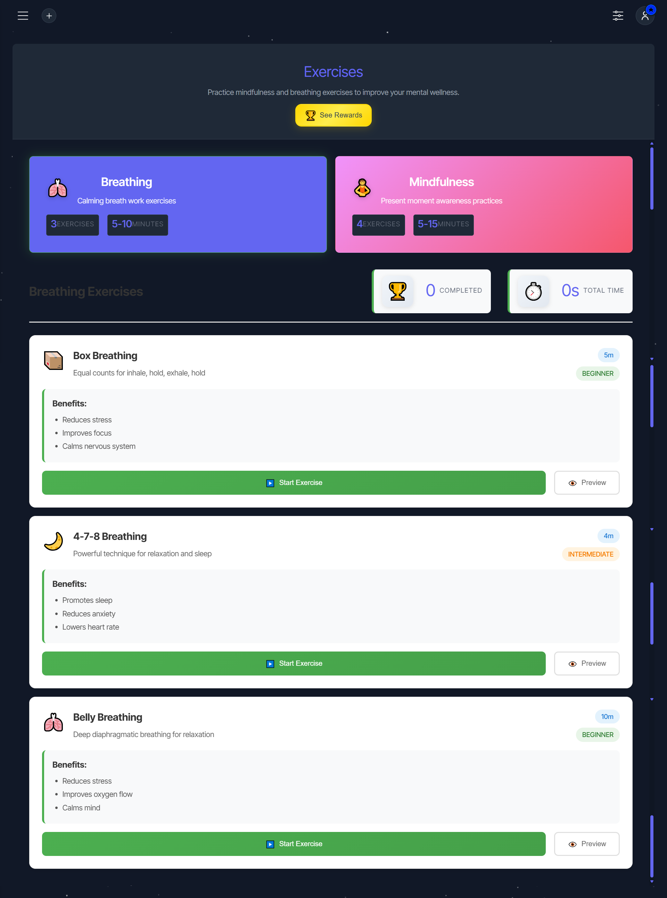
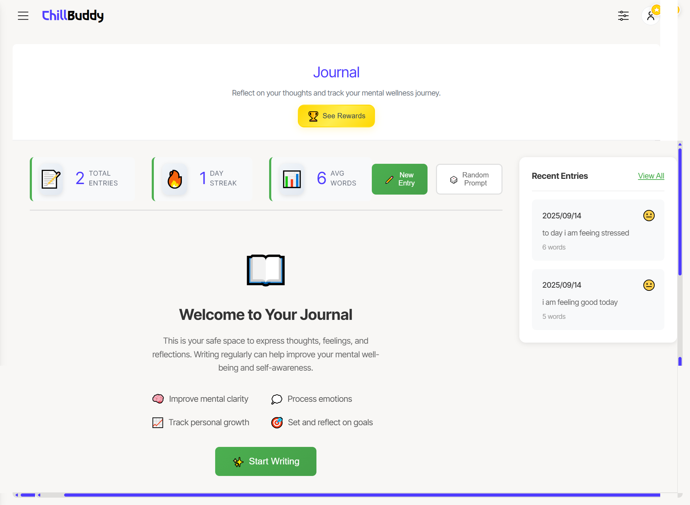

# ChillBuddy Demo Materials 🎬

This folder contains all demonstration materials for ChillBuddy, including videos, presentations, and examples showcasing the mental health support application.

---

## 🎥 Demo Video

### Main Demo Video (7 minutes)
Our comprehensive 7-minute demo showcasing all ChillBuddy features

 I've been waiting more than an hour for the video to upload on youtube and google drive to copy any link but i thing due to network issues its taking a really long time

### Video Content Overview
The demo video covers:

1. **Introduction** (30s)
   - Problem statement: Mental health accessibility
   - ChillBuddy solution overview
  

2. **AI Chat Support** (2 min)
   - Live conversation demonstration
   - Empathetic AI responses
   - Coping strategy suggestions

3. **Mood Tracking** (1.5 min)
   - Mood logging interface
   - Visual mood patterns and insights
   - Progress tracking over time

4. **Gamification System** (1 min)
   - Achievement badges and progress
   - Motivation through positive reinforcement
   - User engagement features

5. **Resource Library** (1 min)
   - Crisis hotlines and support contacts
   - Coping strategies and techniques
   - Educational mental health resources

## 📊 Presentation Materials

### Pitch Deck

**PowerPoint Presentation**: [ChillBuddy Presentation](../assets/chillbuddyPresentation.pptx)

## 🖼️ Screenshots & Examples

### Application Screenshots

*Clean, welcoming homepage with intuitive navigation*

*AI conversation in action showing empathetic responses*

*Mood visualization dashboard with progress insights*

*Progress tracking system showing user achievements*

*Mental health resource library with crisis support*

*Responsive navigation sidebar for easy access*

*User profile management interface*

*Interactive breathing exercises for stress relief*

*Personal journaling feature for self-reflection and tracking thoughts*

## 🏆 Hackathon Context

### South African Intervarsity Hackathon 2025
- **Theme**: Technology for Social Good
- **Focus**: Mental Health Accessibility
- **Team**: The detect3rs
- **Institution**: University of Cape Town
- **Duration**: 48-hour development sprint

### Judging Criteria Alignment
- **Innovation**: AI-powered mental health support
- **Technical Excellence**: Full-stack implementation with AI integration
- **Social Impact**: Addressing mental health accessibility crisis
- **User Experience**: Intuitive, empathetic design
- **Completeness**: Fully functional prototype with comprehensive features

---

## 📞 Contact & Links

- **GitHub Repository**: https://github.com/IviweBooi/chillbuddy
- **Live Demo**: http://localhost:8000 (when servers running)
- **Team Contact**: booiiviwe4394@gmail.com
- **Project Lead**: Iviwe Booi (University of Cape Town)

---

*Last updated: September 2025*

**Ready to change how we approach mental health support, one conversation at a time.** 🌟
